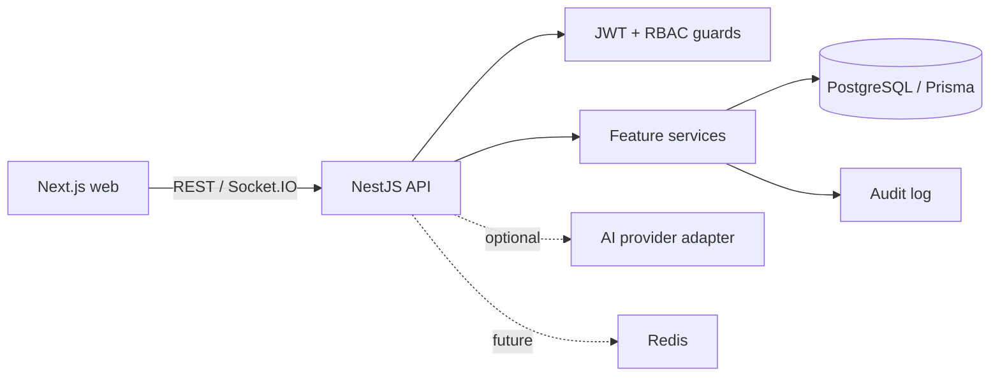

# NexusForge Architecture

NexusForge is a modular TypeScript monorepo. The Next.js client owns presentation and session-aware navigation. The NestJS API exposes a versionable REST boundary, validates DTOs, resolves identity from short-lived bearer tokens, and delegates use cases to feature services. PostgreSQL is the system of record, accessed only through Prisma.



Feature modules own their controllers, DTOs, and services. Organization membership is the tenancy boundary; every project, task, and document operation verifies membership before accessing a record. Global infrastructure includes Prisma, authentication, audit logging, validation, CORS, Helmet, and rate limiting.

Identity uses a short-lived access JWT and a rotating refresh JWT. Each login creates a session with browser, device, IP, login, expiry, and activity data. Refresh tokens are carried in a HTTP-only, same-site cookie and revoked on logout, session revocation, or logout-all. Global roles and permissions are normalized into Role, Permission, UserRole, and RolePermission records; organization membership roles remain the tenant-specific authorization boundary.

AI remains an optional adapter: no core workflow calls an AI provider. Redis is reserved for Socket.IO scaling, queues, caching, and rate-limit storage; local development does not require it.

## Authentication security decisions

- **Refresh-token storage (SHA-256, not bcrypt).** A refresh token is a signed
  JWT far longer than bcrypt's 72-byte input limit, so bcrypt would hash only its
  first 72 bytes and distinct tokens for the same session could collide. Refresh
  tokens are therefore stored as full-length SHA-256 digests and compared in
  constant time. bcrypt (cost 12) is still used for user passwords, which are
  short and benefit from a slow KDF.
- **Refresh-token reuse detection.** Exactly one active refresh token is held per
  session. If a validly signed token is presented whose hash no longer matches the
  current one (a rotated/replayed token), or whose stored record is already
  revoked while the session is still active, the session and its token are revoked,
  an `identity.refresh_reuse_detected` audit event is written, and the request is
  rejected. Only the affected session family is terminated — other sessions are
  untouched.
- **Sanitized responses.** Every auth response that returns a user passes through
  `toPublicUser` (`auth/auth.service.ts`), an explicit field-picker that emits only
  safe fields, so `passwordHash`, roles, and timestamps never reach a response body
  even when a full Prisma row flows through. Refresh tokens stay cookie-only; session
  and role endpoints select safe fields explicitly.
- **Session-bound access tokens.** Every request re-checks the session in the
  database, so a revoked session invalidates its access token immediately.
- **Fail-fast configuration.** The API validates its environment at boot (see
  `apps/api/src/common/env.validation.ts`): required secrets must be present and at
  least 32 characters, and production additionally rejects placeholder or reused
  JWT secrets. Secret values are never included in error output or logs.
- **Abuse throttling.** A global rate limit (100/60s) applies to all routes; the
  credential endpoints (`login`, `register`) add a tighter 10/60s limit. Windows
  roll forward continuously, so no user is ever permanently locked out.

## Database lifecycle

PostgreSQL is provisioned by committed Prisma migrations in `prisma/migrations/`.
`prisma migrate deploy` reproduces the schema on a clean database (used in CI and
production); `prisma migrate dev` authors new migrations during development. The
idempotent seed (`prisma/seed.ts`) establishes the system roles and the permission
catalogue consumed by the RBAC guards.

## Frontend authentication (v0.3.2)

The Next.js app is a real client of the auth API. It uses a browser-SPA-with-refresh-cookie
model — not a BFF — matching the existing backend contract:

```
Browser (web origin :3000)
  fetch(credentials:'include') -- Authorization: Bearer <access, in memory> --> API (:4000)
  - access token: returned in the JSON body, held ONLY in memory (lib/api.ts)
  - refresh token: httpOnly SameSite=Lax cookie on the API origin, JS-invisible
  - on 401 -> single silent POST /api/auth/refresh (cookie) -> rotate -> retry once
```

- **lib/api.ts** — transport: base URL from `NEXT_PUBLIC_API_URL`, credentials included,
  bearer injection, single-flight refresh-and-retry, typed `ApiError` (400/401/403/404/
  409/429/500 mapped to safe messages).
- **lib/auth.ts** — typed wrappers for every auth endpoint (no duplicated fetch logic).
- **lib/auth-context.tsx** — `loading -> authenticated / unauthenticated` state; silent
  refresh on mount; exposes `login`, `register`, `logout`, `logoutAll`, `updateProfile`.
- **components/auth-guard.tsx** — `Protected` / `PublicOnly` client guards.

**Route protection is client-side only.** The refresh cookie is scoped to the API origin,
so Next.js middleware/SSR on the web origin cannot read or validate the JWT — the app does
not claim otherwise. The authoritative boundary remains the API's `JwtAuthGuard`, which
re-checks the session in PostgreSQL on every request. A future **BFF** (Next route handlers
proxying the API behind a first-party httpOnly session cookie) would enable server-side /
middleware protection; it is intentionally out of scope for this milestone. Password reset
and workspace analytics have no backend endpoints yet and are surfaced as honest
placeholders rather than fake functionality.

## Organizations & RBAC (v0.4.0)

Organizations are the multi-tenancy boundary. Every organization-scoped request passes:

```
JwtAuthGuard (identity) -> OrgAccessGuard (membership + org permission) -> service (invariants)
```

**Org-scoped authorization.** The global RBAC guards (`RolesGuard` / `PermissionsGuard`)
check a user's *global* role and are not tenant-aware, so they cannot answer "may this user
update THIS organization". Authorization for organization resources is derived from the
caller's `OrganizationMember.role` (OWNER / ADMIN / MEMBER / VIEWER) — the tenant boundary
the schema already models. `OrgAccessGuard` (`organizations/org-access.ts`) follows the same
Reflector + decorator pattern as `PermissionsGuard`: it resolves the caller's membership for
the `:organizationId` param, attaches it to the request, and checks the required
`@OrgPermissions(...)` against a static role→permission map. It is not a second auth system —
JWT auth, `CurrentUser`, Prisma models, and audit logging are all reused.

Permission map (naming reuses the seed's `organization:*` convention):

| Permission | OWNER | ADMIN | MEMBER | VIEWER |
| --- | :-: | :-: | :-: | :-: |
| organization:read | ✓ | ✓ | ✓ | ✓ |
| organization:update | ✓ | ✓ | | |
| organization:manage_members | ✓ | ✓ | | |

**Isolation (IDOR-safe).** A non-member request for any organization resource returns
**404**, not 403 — the existence of another tenant's org is never disclosed. Authorization is
always explicit and server-side; ID unguessability is never relied upon. Cross-tenant access
is covered by tests (`org-access.spec.ts`) and end-to-end checks.

**Owner-safety invariants** (enforced in `organizations.service.ts`): the creator becomes
OWNER; an organization must always keep at least one owner (last-owner demotion/removal is
rejected); only an OWNER may grant or revoke the OWNER role (blocks admin self-escalation);
managing members requires `organization:manage_members`; a member may remove only themselves
(leave). Important actions emit audit events — `organization.created`, `organization.updated`,
`organization.member_added`, `organization.member_role_changed`, `organization.member_removed`
— with actor, organization, target, and non-sensitive metadata.

**Frontend.** `lib/organizations.ts` wraps the endpoints; an org switcher in the sidebar and
`/organizations` (+`/organizations/[organizationId]`) pages provide create / view / update /
member-management UI. The active organization is the URL segment (no global store). Management
controls are shown per the caller's role for UX only — the backend re-checks every request.
