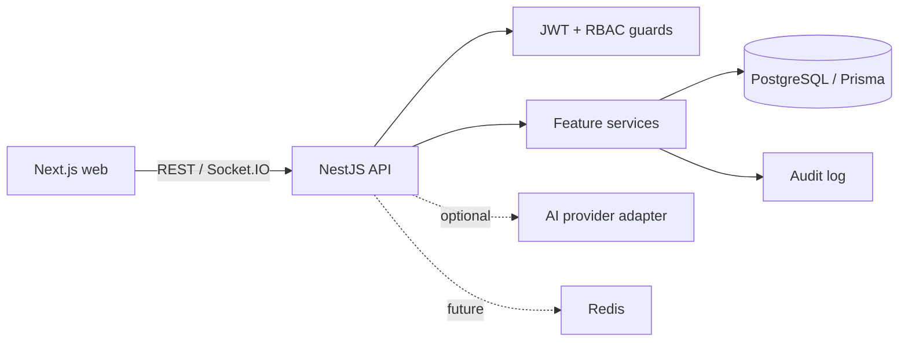

# NexusForge Architecture

NexusForge is a modular TypeScript monorepo. The Next.js client owns presentation and session-aware navigation. The NestJS API exposes a versionable REST boundary, validates DTOs, resolves identity from short-lived bearer tokens, and delegates use cases to feature services. PostgreSQL is the system of record, accessed only through Prisma.

Feature modules own their controllers, DTOs, and services. Organization membership is the tenancy boundary; every project, task, and document operation verifies membership before accessing a record. Global infrastructure includes Prisma, authentication, audit logging, validation, CORS, Helmet, and rate limiting.

Identity uses a short-lived access JWT and a rotating refresh JWT. Each login creates a session with browser, device, IP, login, expiry, and activity data. Refresh tokens are carried in a HTTP-only, same-site cookie and revoked on logout, session revocation, or logout-all. Global roles and permissions are normalized into Role, Permission, UserRole, and RolePermission records; organization membership roles remain the tenant-specific authorization boundary.

AI remains an optional adapter: no core workflow calls an AI provider. Redis is reserved for Socket.IO scaling, queues, caching, and rate-limit storage; local development does not require it.

## Authentication security decisions

- **Refresh-token storage (SHA-256, not bcrypt).** A refresh token is a signed
  JWT far longer than bcrypt's 72-byte input limit, so bcrypt would hash only its
  first 72 bytes and distinct tokens for the same session could collide. Refresh
  tokens are therefore stored as full-length SHA-256 digests and compared in
  constant time. bcrypt (cost 12) is still used for user passwords, which are
  short and benefit from a slow KDF.
- **Refresh-token reuse detection.** Exactly one active refresh token is held per
  session. If a validly signed token is presented whose hash no longer matches the
  current one (a rotated/replayed token), or whose stored record is already
  revoked while the session is still active, the session and its token are revoked,
  an `identity.refresh_reuse_detected` audit event is written, and the request is
  rejected. Only the affected session family is terminated — other sessions are
  untouched.
- **Session-bound access tokens.** Every request re-checks the session in the
  database, so a revoked session invalidates its access token immediately.
- **Fail-fast configuration.** The API validates its environment at boot (see
  `apps/api/src/common/env.validation.ts`): required secrets must be present and at
  least 32 characters, and production additionally rejects placeholder or reused
  JWT secrets. Secret values are never included in error output or logs.
- **Abuse throttling.** A global rate limit (100/60s) applies to all routes; the
  credential endpoints (`login`, `register`) add a tighter 10/60s limit. Windows
  roll forward continuously, so no user is ever permanently locked out.

## Database lifecycle

PostgreSQL is provisioned by committed Prisma migrations in `prisma/migrations/`.
`prisma migrate deploy` reproduces the schema on a clean database (used in CI and
production); `prisma migrate dev` authors new migrations during development. The
idempotent seed (`prisma/seed.ts`) establishes the system roles and the permission
catalogue consumed by the RBAC guards.
