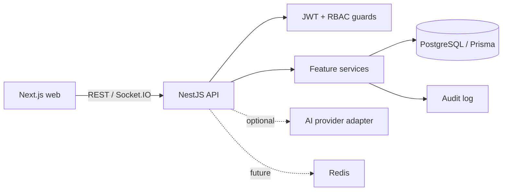

# NexusForge Architecture

NexusForge is a modular TypeScript monorepo. The Next.js client owns presentation and session-aware navigation. The NestJS API exposes a versionable REST boundary, validates DTOs, resolves identity from short-lived bearer tokens, and delegates use cases to feature services. PostgreSQL is the system of record, accessed only through Prisma.

Feature modules own their controllers, DTOs, and services. Organization membership is the tenancy boundary; every project, task, and document operation verifies membership before accessing a record. Global infrastructure includes Prisma, authentication, audit logging, validation, CORS, Helmet, and rate limiting.

Identity uses a short-lived access JWT and a rotating refresh JWT. Each login creates a session with browser, device, IP, login, expiry, and activity data. Refresh credentials are stored only as bcrypt hashes, carried in a HTTP-only, same-site cookie, and revoked on logout, session revocation, or logout-all. Global roles and permissions are normalized into Role, Permission, UserRole, and RolePermission records; organization membership roles remain the tenant-specific authorization boundary.

AI remains an optional adapter: no core workflow calls an AI provider. Redis is reserved for Socket.IO scaling, queues, caching, and rate-limit storage; local development does not require it.
