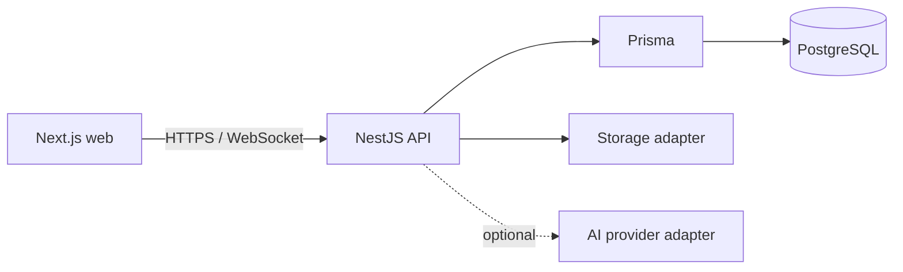

# System Architecture

Controllers translate transport input to application services. Domain services enforce authorization and workflows. Adapters own database, sockets, files, and AI provider details.
